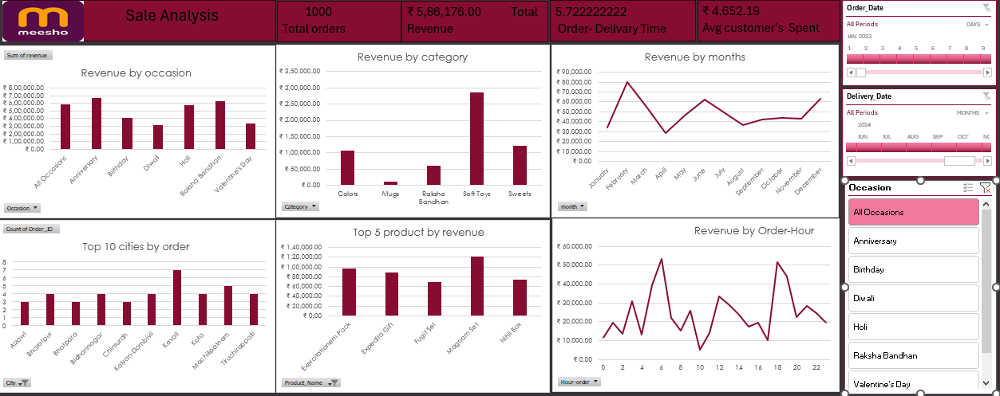

# meesho-data-analysis-excel

# Meesho Sales Dashboard 📊

This Excel-based dashboard provides deep insights into Meesho's sales data. It's a visual analytics project showcasing order performance, revenue trends, category-wise and occasion-wise distribution, and customer behavior.

---

## 🔍 Key Insights

- **📦 Total Orders:** 1000  
- **💰 Total Revenue:** ₹5,86,176.00  
- **⏱️ Avg. Delivery Time:** ~5.72 days  
- **👤 Avg. Customer Spend:** ₹4,652.19  

---

## 📈 Dashboard Components

- **Revenue by Occasion**
- **Revenue by Category**
- **Revenue by Months**
- **Top Cities by Orders**
- **Top Products by Revenue**
- **Revenue by Hour of Order**

---

## 🧰 Tools Used

- Microsoft Excel (Pivot Tables, Slicers, Charts)
- Power Query (optional)
- Manual Data Cleaning

---

## 🖼️ Preview

---

## 📝 How to Use

1. Download the `.csv` files and open the Excel dashboard.
2. Use slicers to filter by Occasion, Month, and Date.
3. Observe KPI changes and chart updates dynamically.

---

## 📩 Contact

For suggestions or collaborations, feel free to connect via [LinkedIn](https://www.linkedin.com).

---

> ⚠️ **Disclaimer:** This project is intended solely for educational and portfolio purposes. It is **not affiliated with, endorsed by, or officially connected to Meesho or its parent company** in any way.  
> The data used in this dashboard is **completely fictional and does not reflect real sales or customer data from Meesho**. All trademarks and brand names are the property of their respective owners.
